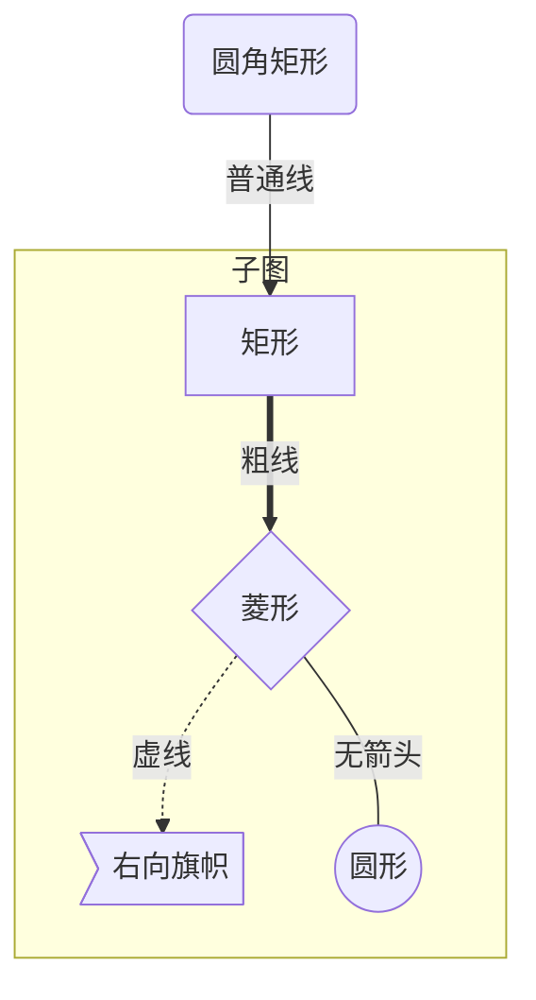

本篇技术手册由个人编撰汇总而成。旨在撰写`Markdown`时便于记忆查询

<!--more-->

## 标题

在 `MarkDown` 中，将`#`置于开头并在其后加上一个或一个以上空格用于标记标题，`#`越多，代表标题级数越多，最多六级。

`#`一级标题  
`##`二级标题  
`###`三级标题  
`####`四级标题  
`#####`五级标题  
`######`六级标题  

## 语法

对于段落的判定，换行即可  
部分`MarkDown`编辑器若要文字段落换行，需在换行后前一段后面加上两个或两个以上空格(如`VsCode`)。  
用于标记的空格只能用半角空格。  
如果想要写的美观，可以参考[`MarkDown`规则文档](https://github.com/DavidAnson/markdownlint/blob/v0.23.1/doc/Rules.md)

## 段落样式

* `Text` : 文本

### *斜体*

在需斜体的文字两旁加上一个星号。

`*Text*`

### **粗体**

在需要粗体的文字两旁加上两个星号。

`**Text**`

### ***粗斜体***

在需要粗斜体的文字两旁加上三个星号。

`***Text***`

### 分隔线

在一行中用三个或三个以上的星号(*)、减号(-)、底线(_)，可以在星号、减号、底线之间插入空格，数量不限。

```MarkDown
***
* * *
---
- - - 
___
_ _ _
```

### 删除线

在需要添加删除线的文字两旁加上两个波浪线。

`~~Text~~`

### 下划线

可以通过内联HTML的`<u>Text</u>`标签来实现。

### 脚注

脚注是对文本的补充说明，可以通过 `[^Name]` 标记，标记后可以在MarkDown文档任意地方进行注释。  
注释方法：`[^Name]:Text`

* `Name` : 标记名称
* `Text` : 注释文本

```MarkDown
耄耋[^1]
焱[^2]

[^1]:年纪八十到九十的老人
[^2]:火花
```

## 列表

MarkDown支持无序列表和有序列表。

### 无序列表

无序列表使用星号(*)、加号(+)或是减号(-)作为列表标记，这些标记后面要添加一个或以上空格，然后再填写内容。  
星号、加号、减号之间可以混用，但代码层面不美观。

```MarkDown
* 1
* 2
* 3

+ 1
+ 2
+ 3

- 1
- 2
- 3
```

### 有序列表

有序列表使用阿拉伯数字加上点(.)和一个空格表示。

```MarkDown
1. 1
2. 2
3. 3
```

### 列表嵌套

列表嵌套只需要在子列表前加上一个或一个以上空格  
不能把有序列表作为子列表

```MarkDown
1. 1
  * 1-1

* 1
  * 1-1
  * 1-2
```

## 区块

在段落开头加上`>`符号后紧跟一个空格。  
区块可嵌套，有几层嵌套前面就有几个`>`符号，`>`之间用一个或一个以上空格隔开，别忘用空格分开文字与区块标记。  
区块可用于列表中，列表中也可以使用区块。使用方法只需标签的叠加。

```MarkDown
> 1
> > 2
> > > 3

1. > 1
2. > 2
  * > 2-1

* > 1
+ > > 2
- > > > 3
```

## 代码

### 片段代码

可以在代码两旁添加反引号(\`)向`MarkDown`表示这是代码。

```C
`printf("Hellow World");`
```

### 代码区块

可以用四个空格或一个制表符(Tab)加在区块每一行开头向`MarkDown`表示这是一段代码区块。  

```C#
    public int Get()
    {
        return 1;
    }
```

也可以用三个反引号(`)或三个波浪号(~)包裹代码区块，并可以指定一种语言。

```MarkDown
    ```C++
    int* p = 1;
    ```

    ```C#
    private score = 0;
    ```
```

## 链接

### 简单链接

使用`[Name](url)`或`<url>`

* `Name` : 链接名字
* `url` : 地址

```MarkDown
[百度](www.baidu.com)
<www.bing.com>
```

### 高级链接

使用`[Name][var]`设置一个变量，然后使用`[var]:Text`在文档其余任意地方给变量赋上链接值。  

* `Name` : 标记名称
* `var` : 变量名称
* `Text` : 注释文本

```MarkDown
[Google][1]

[1]:http://www.google.com
```

## 图片

使用``来表示图片。  
也可以使用`![FailText][var]`标记，然后使用`[var]:url`在文档任意地方给变量赋上图片链接值。  

* `FailText` : 图片加载显示失败时显示的文本
* `url` : 图片地址
* `var` : 变量名称
* `title` : 图片名称

```MarkDown


![Picture2][1]

[1]:https://ss0.bdstatic.com/70cFvHSh_Q1YnxGkpoWK1HF6hhy/it/u=2595316365,4277938543&fm=26&gp=0.jpg "title 2"
```

## 表格

### 基础

表格的制作使用`|`符号分隔列，使用一个或一个以上的减号(-)分隔表头和其他行，使用换行分隔行。  
注意要在每行开头和结尾加上`|`表示表格。  
`|`和列之间要有一个或一个以上的空格分隔。

```MarkDown
| Price | number |
| - | - |
| 1 | 2 |
| 2 | 1 |
```

### 对齐方式

可以用下列三种格式替换减号(-)来分隔表头和其他行并表示对齐方式。  
其中减号(-)同理可以一个或一个以上的数量

* `:-` 设置内容和标题栏居左对齐。
* `-:` 设置内容和标题栏居右对齐。
* `:-:` 设置内容和标题栏居中对齐。

```MarkDown
| Left | Right | center |
| :-----| ----: | :----: |
| block | block | block |
| block | block | block |
```

## 高级技巧

### `HTML`元素

可以使用`HTML`标签。

```Html
<kbd>Ctrl</kbd>+<kbd>Alt</kbd>+<kbd>Del</kbd>
```

### 转义

在特定字符前加上一个反斜杠使其单作为文字显示。  
`MarkDown`支持以下特殊字符前加反斜杠。

\\   反斜线  
\`   反引号  
\*   星号  
\_   下划线  
\{\}  花括号  
\[\]  方括号  
\(\)  小括号  
\#   井字号  
\+   加号  
\-   减号  
\.   英文句点  
\!   感叹号  

### 公式

如果要在编辑器中插入公式，可以使用一个美元符号(`$`)包裹`TeX`或`LaTeX`格式的数学公式来实现。  
单独显示的`LaTeX`公式用`$$...$$`定义。  
`MathJax`公式使用这里不再赘述，详情请自行搜索。

```MarkDown
$\sum_{i=0}^N\int_{a}^{b}g(t,i)\text{d}t$
$$\sum_{i=0}N\int_{a}{b}g(t,i)\text{d}t$$
```

### 流程图

本篇会简单讲解流程图的画法，若要了解其他图表的画法，可以参考
[CSDN-【Tools】MarkDown教程(四)-MarkDown中的UML图](https://blog.csdn.net/dengjin20104042056/article/details/107073187)

流程图需先表示为代码块。  
语言目前有三种：`flow`、`mermaid`和`UML`

```MarkDown
    ```flow
    Code Block
    ```

    ```mermaid
    Code Block
    ```

    ```sequence
    Code Block
    ```
```

* `Code Block` : 代码块

#### `flow`

`flow`中流程图大致分为两部分

1. 定义元素
2. 定义走向

##### `Flow`元素

语法：`tag=>type: content:>url`  
`type`后的冒号与文本之间一定要有个空格。

* `tag` : 元素名称
* `type` : 元素类型(必须小写)
  * `start` : 开始
  * `end` : 结束
  * `operation` : 操作
  * `subroutine` : 子程序
  * `condition` : 条件
  * `input` : 输入
  * `output` : 输出
* `content` : 内容
* `url` : 链接

##### 连接`Flow`元素

用`->`来连接两个元素  形成一个流程。

```MarkDown
Element1->Element2->Element3
```

`condition`类型有两个分支，所以要分为两个流程。  
括号内的`yes/no`必须小写

```MarkDown
c1(yes)->Enement1
c2(no)->Element2
```

若在连接元素后加上`(left)`/`(right)`/`(top)`/`(buttom)`即表示：相对该元素向左/右/上/下延伸

##### `Flow`示例

```flow
s1=>start: Start
e1=>end: First End
e2=>end: Second End
c1=>condition: choose
o1=>operation: operate
s1->c1(yes)->e1
c1(no)->o1(right)->e2
```

```MarkDown
    ```flow
    s1=>start: Start
    e1=>end: First End
    e2=>end: Second End
    c1=>condition: choose
    o1=>operation: operate
    s1->c1(yes)->e1
    c1(no)->o1(right)->e2
    ```
```

#### `mermaid`

`mermaid`中流程图元素是边定义边连接的。  
但在此之前需先定义是横向还是纵向。  
定义语法：`graph type`

* type : 类型
  * LR : 横向
  * TD : 纵向

不同于`flow`，最后的结尾需换行打`end`。

##### `Mermaid`元素

`Element` : `Name` `Symbol1` `Text` `Symbol2`  
类似于夹心饼干，或者说颜文字

* `Element` : 元素
* `Name` : 元素名称
* `Symbol1` : 元素形状开头标记，需与结尾标记对应
  * `[` 矩形  
  * `(` 圆角矩形  
  * `{` 菱形  
  * `>` 右向旗帜  
  * `((` 圆形  
* `Text` : 文本
* `Symbol2` : 元素形状结尾标记，需与开头标记对应
  * `]` 矩形  
  * `)` 圆角矩形  
  * `}` 菱形  
  * `]` 右向旗帜  
  * `))` 圆形  

##### 连接`Mermaid`元素

连接语法：`Element1` `Symbol1` `Text` `Symbol2` `Element2`  
连接两个元素

* `Element1` : 连接的起点元素
* `Symbol1` : 开始符号，需与结束符号对应
  * `==` : 粗线
  * `-.` : 细线
  * `--` : 无箭头
* `Text` : 文本
* `Symbol2` : 结束符号，需与开始符号对应
  * `==` : 粗线
  * `-.` : 细线
  * `--` : 无箭头
* `Element2` : 连接的终点元素

##### `Mermaid`示例



```MarkDown
    ```mermaid
    graph TD
    id1(圆角矩形)--普通线-->id2[矩形];
    subgraph 子图
    id2==粗线==>id3{菱形}
    id3-.虚线.->id4>右向旗帜]
    id3--无箭头---id5((圆形))
    end
    ```
```

### 待办事项(Todo)

语法：`- [ ] 文本` 或 `- [X] 文本`，X不限大小写  
X代表已完成

#### 案例

- [ ] 未完成
- [x] 已完成

```Markdown
- [ ] 未完成
- [x] 已完成
```

参考网址：  
[1] [菜鸟教程](https://www.runoob.com/markdown/md-tutorial.html)  
[2] [简书.ColdRomantic.在Markdown中输入数学公式](https://www.jianshu.com/p/a0aa94ef8ab2)  
[3] [简书.Jlan.用markdown`来画流程图](https://www.jianshu.com/p/02a5a1bf1096)  
[4] [简书.VsCode支持的markdown语法参考](https://www.jianshu.com/p/fd761fc43753)  
[5] [MarkDown规则](https://github.com/DavidAnson/markdownlint/blob/v0.23.1/doc/Rules.md)
